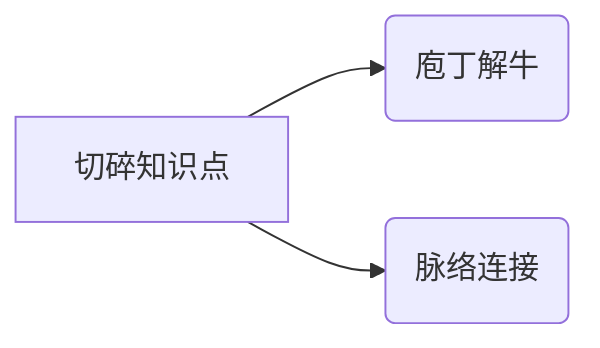

学习笔记

[toc]

### 如何进行学习

#### 1.视频 

*  最佳办法：1.5~2.0倍数播放、难点(暂停+反复看)
*  最差方法：正常速度，只看一次

#### 2.摒弃“旧”习惯
* 不要死磕
* 五毒神掌
* 不懒于看高手代码

>总结：5分钟想不出来，直接看题解或高票代码。不要花2-3个小时想一晚

最大误区：LeetCode题目只做一次

#### 3.期待结果
* 顶尖水平：对于算法数据结构的理解
* 一线互联网公司面试
* LeetCode 300+的积累

#### 4.推荐书籍
《异类:不一样的成功启示录》 作者:马尔科姆·格拉德威尔

#### 5.精通一个领域
**一、Chunk it up 切碎知识点**

				
**数据结构**

一维:
• 基础:数组 array (string), 链表 linked list
• 高级:栈 stack, 队列 queue, 双端队列 deque, 集合 set, 映射 map (hash or map), etc

 二维:
• 基础:树 tree, 图 graph
• 高级:二叉搜索树 binary search tree (red-black tree, AVL), 堆 heap, 并查集 disjoint set, 字典树 Trie, etc

特殊:
• 位运算 Bitwise, 布隆过滤器 BloomFilter
• LRU Cache

					
**算法**

						
							
* If-else, switch —&gt; branch

							
							
* for, while loop —&gt; Iteration

							
							
* 递归 Recursion (Divide &amp; Conquer, Backtrace)

							
							
* 搜索 Search: 深度优先搜索 Depth first search, 广度优先搜索 Breadth first search, A*, etc

							
							
* 动态规划 Dynamic Programming

							
							
* 二分查找 Binary Search

							
							
* 贪心 Greedy

							
							
* 数学 Math , 几何 Geometry

* 注意:在头脑中回忆上面每种算法的思想和代码模板
				
****				

**二、Deliberate Practicing 刻意练习**

1.切题四件套
• Clarification
• Possible solutions
• compare (time/space)
• optimal(加强) • Coding(多写)
• Test cases

2.过遍数(五毒神掌)
 * <u>刷题第一次</u>
  • 5分钟:读题 + 思考
  • 直接看解法:注意!多解法，比较解法优劣 
  • 背诵、默写好的解法
 * <u>刷题第二次</u>
  • 马上自己写 —> LeetCode 提交 
  • 多种解法比较、体会 —> 优化
 * <u>刷题第三次</u>
  • 过了一天后，再重复做题
  • 不同解法的熟练程度 —> 专项练习
 * <u>刷题第四次</u>
  • 过了一周:反复回来练习相同题目
 * <u>刷题第五次</u>
  • 面试前一周恢复性训练

3.练习缺陷、弱点地方

* Feedback 反馈

### 加一算法总结
1。js对数字是有边界的，除了 除法不准，需要考虑边界问题。

JavaScript中Number范围为正负2的53次方，也即从最小值-9007199254740992到最大值+9007199254740992之间的范围。
−9007199254740992 and 9007199254740992 （即正负2的53次方） 11位

2.因为涉及大数，所以不能用数组转成字符串，字符串转成数字计算+1

### 移动零
解题思路
1. 从零开始遍历， 遇到0， 把它当前的位置删除
2. i--, 后面结束后会i++, 就是从之前它的位置重新开始遍历
3. 然后数组后面加0， 遍历次数需要--, 因为后面的0的位置不需要重新遍历了,
 如果不减, 则会无限循环下去， 并且长度递增。